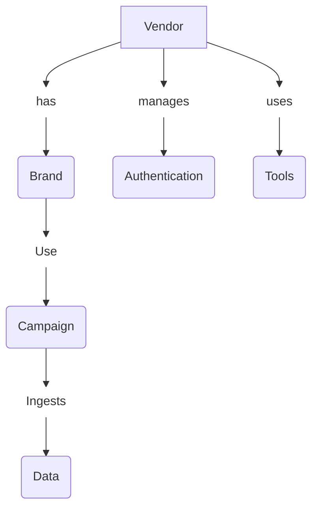

The Charp.ai platform provides a structured API set for vendors to manage brands, campaigns, and related tools. This section outlines the primary API categories and their core functionalities.

## API Structure

Our API ecosystem is organized into five main categories, each serving a specific purpose in the vendor workflow:

## Available APIs

<AccordionGroup>
  <Accordion title="Vendor API" icon="building">
    
The Vendor API manages vendor accounts and details.

    <ul>
      {    /* <li>CRUD operations for managing vendors (primarily for internal use)</li> */}
      <li>Vendors can view their details and update minor information</li>
      <li>When a vendor is created, they receive:</li>
        <ul>
          <li>Client ID & Secret Key (for authentication)</li>
          <li>Plan details (Free, Standard, Enterprise)</li>
          <li>Account limits & credit system (if applicable)</li>
        </ul>
    </ul>
  </Accordion>
  
  <Accordion title="Authentication API" icon="key">
    
The Authentication API handles secure access to the platform.

    <ul>
      <li>Standard OAuth2-based authentication</li>
      <li>Vendors can generate an access token using their Client ID and Secret</li>
      <li>This token is required to access Campaign and Tools APIs</li>
    </ul>
  </Accordion>
  
  <Accordion title="Brand API" icon="tag">
    
The Brand API enables management of brand entities.

    <ul>
      <li>Vendors manage brands (companies they handle customers for)</li>
      <li>Provides CRUD operations for brand management</li>
    </ul>
  </Accordion>
  
  <Accordion title="Campaign API" icon="bullhorn">
    
The Campaign API facilitates campaign creation and management.

    <ul>
      <li>Vendors create and manage campaigns for a specific brand</li>
      <li>Campaign operations include:</li>
        <ul>
          <li>Data Ingestion (uploading and processing campaign data)</li>
          <li>Callback & Egress API (for data delivery)</li>
          <li>Start/Stop Campaign (control campaign execution)</li>
          <li>Campaign Scheduling (set time slots for execution)</li>
          <li>Campaign Insights (fetch campaign performance data)</li>
        </ul>
    </ul>
  </Accordion>
  
  <Accordion title="Tools API" icon="toolbox">
    
The Tools API provides specialized utilities for campaign enhancement.

    <ul>
      <li>Provides additional tools for vendors to enhance campaign execution</li>
      <li>APIs for data transformation, media processing, and analytics</li>
      <li>Includes functionality for TTS, voice cloning, lip sync, and face swap</li>
    </ul>
  </Accordion>

  <Accordion title="Virtual Tryon Apparel API" icon="toolbox">
    
The Virtual Tryon API provides cutting-edge AI features for apparel visualization.

    <ul>
      <li>Allows users to preview how clothing will look on them without physical trials</li>
      <li>Generates highly realistic composite images in seconds</li>
      <li>Requires a photo of the person and the garment as input</li>
      <li>Enhances customer experience and boosts campaign engagement</li>
    </ul>
  </Accordion>
</AccordionGroup>

## API Access by Plan

Different vendor plans provide varying levels of access to our API ecosystem:

<CardGroup cols={3}>
  <Card title="Free" icon="leaf">
    
Basic access to Brand and Campaign APIs with limited requests

  </Card>
  <Card title="Standard" icon="star">
    
Full access to Brand, Campaign, and basic Tools APIs

  </Card>
  <Card title="Enterprise" icon="building">
    
Unlimited access to all APIs with premium support

  </Card>
</CardGroup>

## Next Steps

Proceed to the [API Authentication Flow](/api_authentication_flow) section to learn how to authenticate and start using our APIs.