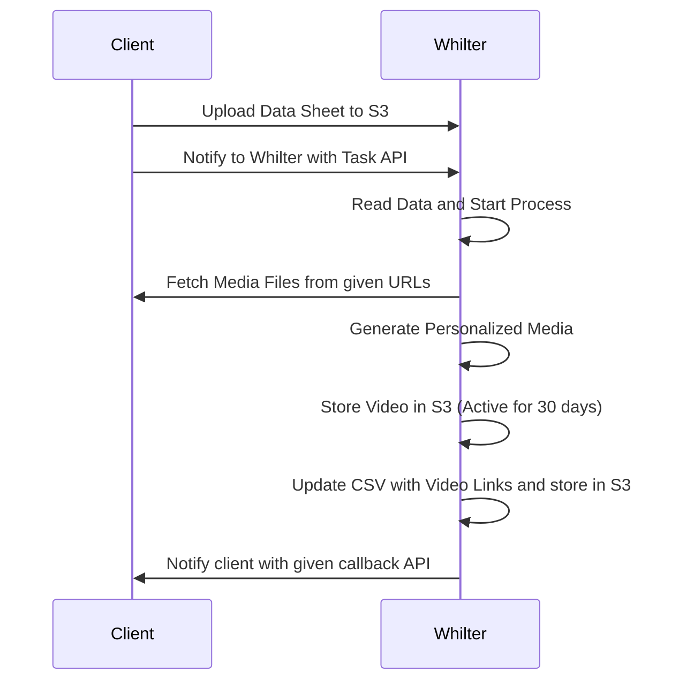

import Tabs from "@theme/Tabs";
import TabItem from "@theme/TabItem";

# Overview

Whilter.AI’s **Batch Media API** enables clients to process and deliver large-scale personalized campaigns using a structured batch-based integration flow. Whether you're generating thousands of personalized images or videos, this API ensures smooth and efficient execution.

---

## High-Level Integration Flow



The batch execution flow consists of the following 5 simple steps:

### Step 1: Prepare Your Data Sheet

Prepare a CSV file containing:

- A **unique identifier** (e.g., phone number or customer ID)
- Additional fields for **personalization**

---

### Step 2: Naming the Data Sheet

Use the following naming conventions based on priority:

- **High Priority Campaign:**  
  `WhilterTemplateID_Priority_CustomerDefinedCampaignName.zip`

- **Normal Priority Campaign:**  
  `WhilterTemplateID_CustomerDefinedCampaignName.zip`

> _Make sure to compress the CSV as a ZIP file before uploading._

---

### Step 3: Upload to S3

Upload the `.zip` file to your designated **S3 bucket path** as instructed by the Whilter.AI onboarding team.

---

### Step 4: Trigger the Task via API

Notify Whilter.AI that the file has been uploaded using the Task API.

#### **POST** `/client/task`

```http
POST https://<whilter-api-host>/<client>/task
```

#### Request Headers:

```json
{
  "Authorization": "Bearer <access-token>",
  "Content-Type": "application/json"
}
```

#### Request Body:

```json
{
  "client-id": "string",
  "campaign-id": "string",
  "template-id": "string",
  "file-name": "string",
  "file-path": "string",
  "row-count": 0,
  "expected-output-duration": 0
}
```

#### Sample Response:

```json
{
  "client-id": "string",
  "campaign-id": "string",
  "template-id": "string",
  "task-id": "string",
  "message": "Task created successfully."
}
```

---

### Step 5: Check Task Status (Optional)

Track task progress using the task ID.

#### **GET** `/client/task/status/<task-id>`

```http
GET https://<whilter-api-host>/<client>/task/status/<task-id>
```

#### Request Headers:

```json
{
  "Authorization": "Bearer <access-token>"
}
```

#### Sample Response:

```json
{
  "task-id": "string",
  "status": "pending | in-progress | completed",
  "count": 0,
  "message": "string",
  "file-path": "string"
}
```

> The output file will mirror your input CSV but with two additional columns:
>
> - `media-url`: Link to the generated media
> - `error`: If generation failed for a row

---

### Step 6: Cancel a Task (Optional)

If you need to cancel a previously triggered task (for example, due to incorrect data or a campaign change), use the following API.

#### **POST** `/image/task/cancel/{taskId}`

```http
POST https://<whilter-api-host>/image/task/cancel/{taskId}
```

#### Path Parameter:

| Name   | Type   | Description                                 |
| ------ | ------ | ------------------------------------------- |
| taskId | string | The unique identifier of the task to cancel |

#### Request Headers:

```json
{
  "Authorization": "Bearer <access-token>",
  "Content-Type": "application/json"
}
```

#### Sample Response:

```json
{
  "client-id": "string",
  "campaign-id": "string",
  "template-id": "string",
  "task-id": "string",
  "message": "Task cancelled successfully"
}
```

---

## API Reference

To explore detailed endpoints and example requests, 
see the [Batch Media API references](/api-reference/batch-media-api/create-batch-task).

---

## Callback Support

Instead of polling the status API, you can provide a **callback URL**, and Whilter.AI will notify your system automatically when the task is completed.

---

## Security

All APIs are secured using **Bearer Token Authentication**. Ensure your access token is kept confidential.

---

Need help integrating? [Contact us](mailto:support@whilter.ai) or explore more API references in the sidebar.
