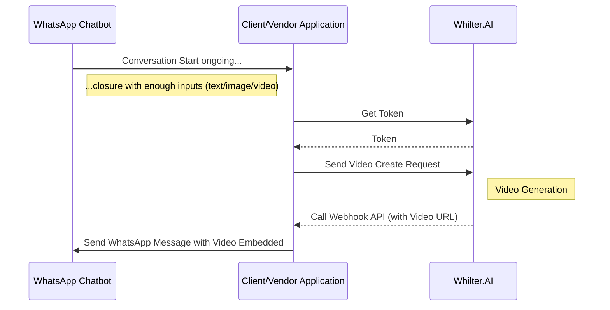

import Tabs from "@theme/Tabs";
import TabItem from "@theme/TabItem";

# Overview

Whilter.AI’s **Realtime Media API** allows client systems (like chatbots or apps) to trigger personalized video generation dynamically. This API is optimized for rapid, transactional media creation based on real-time user input or actions.



---

## Step 1: Get Access Token

All API calls require a valid access token.

**GET** `/getToken`

```http
GET https://<API-Host>/getToken?clientId=<clientId>&clientSecret=<clientSecret>
```

> Request must be made from a **whitelisted IP**.

**Sample Response:**

```json
{
  "access_token": "<token_value>",
  "expires_in": 86400,
  "token_type": "Bearer"
}
```

---

## Step 2: Trigger New Video Generation

**POST** `/video/demo`

```http
POST https://<API-Host>/video/demo
```

**Headers:**

- `x-api-key: <provided-api-key>`
- `Authorization: Bearer <access_token>`

**Request Body:**

```json
{
  "client-request-id": "unique-id",
  "customer-id": "customer-id",
  "use-case-id": "template-id",
  "user-id": "user-id",
  "reference-record-id": "optional",
  "phrase-texts": ["Text A", "Text B"],
  "image-texts": ["Text A", "Text B"],
  "video-texts": ["Text A", "Text B"],
  "image-urls": ["https://s3.amazonaws.com/img1.jpeg"],
  "video-urls": ["https://s3.amazonaws.com/video1.mp4"]
}
```

**Response:**

```json
{
  "status": "SUCCESS",
  "message": "Request accepted",
  "client-request-id": "unique-id",
  "whilter-request-id": "generated-id"
}
```

---

## Step 3: Check Video Status

**GET** `/status/<transaction-id>`

```http
GET https://<API-Host>/status/<transaction-id>
```

**Headers:**

- `x-api-key: <provided-api-key>`
- `Authorization: Bearer <access_token>`

**Response:**

```json
{
  "status": "SUCCESS",
  "message": null,
  "video-url": "https://cdn.whilter.ai/video.mp4",
  "image-url": "https://cdn.whilter.ai/image.jpg"
}
```

> Note: `video-url` may initially be null. You can poll until the video is ready.

---

## Optional: Webhook Notification (Recommended)

You may provide a webhook endpoint to receive video URLs automatically when the video is ready.

**POST** `/video-push-endpoint`

```json
{
  "client-request-id": "unique-id",
  "user-id": "user-id",
  "video-url": "https://cdn.whilter.ai/video.mp4"
}
```

**Suggested Response:**

```json
{
  "client-request-id": "unique-id",
  "status": "202"
}
```

---

## Error Handling

| Error Code | Description        | Suggested Action                         |
| ---------- | ------------------ | ---------------------------------------- |
| 400        | Bad Request        | Check input JSON or parameters           |
| 404        | Endpoint Not Found | Check API URL                            |
| 500        | Server Error       | Retry after some time or contact support |

## API Reference

To explore detailed endpoints and example requests,
see the [Realtime Media API references](/api-reference/realtime-media-api/create-realtime-task).

---

Need help integrating? [Contact us](mailto:support@whilter.ai) or explore more API references in the sidebar.
